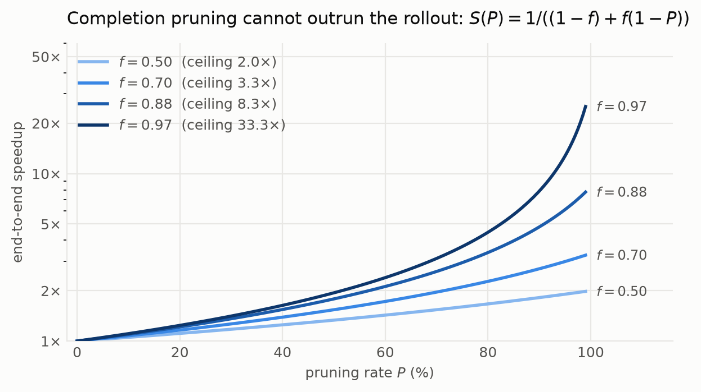
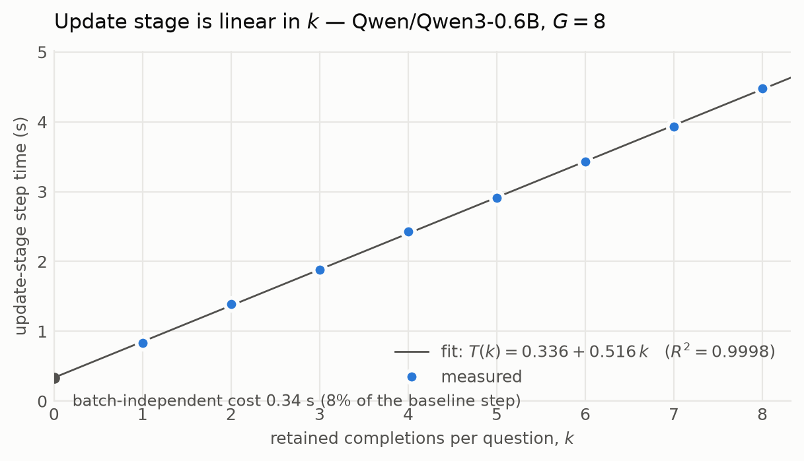
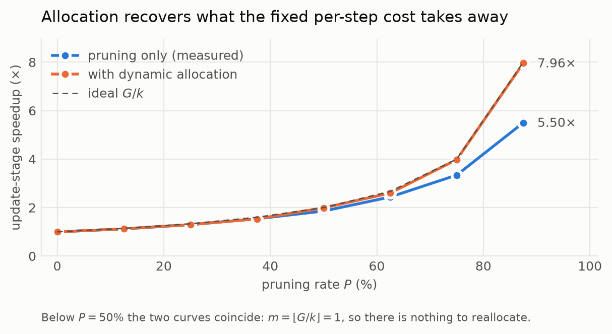

# Accelerating GRPO Post-Training with Completion Pruning (CPPO)

GRPO and CPPO post-training pipelines for **Qwen3-0.6B** on **DAPO-Math-17k**,
built on [TRL](https://github.com/huggingface/trl), evaluated with
[lm-evaluation-harness](https://github.com/EleutherAI/lm-evaluation-harness) on
`gsm8k`, `minerva_math` and `aime24`.

> **The question this repository answers:** how accurate is
> [CPPO](https://arxiv.org/pdf/2503.22342), and how much does it actually
> accelerate RL training?
>
> **Short answer:** CPPO's accuracy cost is close to zero in the `P ∈ [0.5, 0.875]`
> band, because group-standardised rewards concentrate almost all of the
> learning signal in a small minority of completions. Its *speedup*, however,
> is bounded by Amdahl's law on the rollout stage, which completion pruning
> cannot touch: `S(P) = 1 / ((1-f) + f(1-P))` where `f` is the update stage's
> share of training time. Published 8× figures describe configurations where
> `f ≈ 0.9`; in a modern KL-free setup with a vLLM rollout, `f` — and therefore
> the payoff — is smaller. Details in [Analysis](#7-analysis).

---

## Contents

1. [Quick start](#1-quick-start)
2. [Repository layout](#2-repository-layout)
3. [Background: GRPO](#3-background-grpo)
4. [CPPO: completion pruning](#4-cppo-completion-pruning)
5. [Implementation](#5-implementation)
6. [Experimental setup](#6-experimental-setup)
7. [Analysis](#7-analysis)
8. [Results](#8-results)
9. [Reproducing the study](#9-reproducing-the-study)
10. [Code quality](#10-code-quality)
11. [Limitations](#11-limitations)
12. [References](#12-references)

---

## 1. Quick start

```bash
git clone https://github.com/saifutdinov2008/cppo-grpo-acceleration.git
cd cppo-grpo-acceleration

# Creates .venv and installs the project plus its eval/dev extras.
# Add --with-vllm on a CUDA machine to install the fast rollout backend.
bash scripts/setup.sh
source .venv/bin/activate

# Validate the whole pipeline without a GPU (~ a few minutes):
# lint + types + unit tests, then two real training steps of GRPO and of
# CPPO on Qwen3-0.6B and DAPO-Math-17k.
bash scripts/smoke_test.sh
```

Then, on a GPU:

```bash
bash scripts/train.sh configs/grpo.yaml         # GRPO baseline
bash scripts/train.sh configs/cppo_p75.yaml     # CPPO, P = 0.75
bash scripts/evaluate.sh outputs/cppo-p75 results/cppo-p75/eval.json

# ...or the entire study (baseline + 3 pruning rates + ablation + evals):
bash scripts/run_all.sh
```

---

## 2. Repository layout

```
src/cppo/
  pruning.py     Top-k selection by |advantage| — the mathematical core
  geometry.py    Pruning rate -> TRL batch parameters (dynamic allocation)
  trainer.py     ProfiledGRPOTrainer (baseline) and CPPOTrainer
  profiling.py   Stage timing + peak memory, shared by both trainers
  rewards.py     Format and accuracy rewards (math_verify)
  data.py        DAPO-Math-17k loading and prompt templating
  train.py       Training entry point            (`python -m cppo.train`)
  evaluate.py    lm-evaluation-harness wrapper   (`python -m cppo.evaluate`)
  report.py      Renders result tables           (`python -m cppo.report`)
configs/         base.yaml + one file per experiment (YAML `extends:` inheritance)
scripts/         setup / train / evaluate / benchmark / smoke_test / run_all / lint
benchmarks/      update_stage_benchmark.py — isolates CPPO's effect from the rollout
                 plot_results.py            — renders the report's figures
tests/           91 unit tests + 4 end-to-end trainer tests
report/          report.tex, references.bib, figures/, Makefile
results/         JSON artefacts produced by the runs (measurements live here)
```

---

## 3. Background: GRPO

For a question `q`, the old policy samples a **group** of `G` completions.
GRPO replaces PPO's learned critic with a baseline computed from that group,
maximising

```
J_GRPO(θ) = E_q, {o_i} [ (1/G) Σ_i (1/|o_i|) Σ_t {
                min( ρ_i,t(θ)·A_i ,  clip(ρ_i,t(θ), 1-ε, 1+ε)·A_i )
                − β·D_KL[π_θ ‖ π_ref] } ]
```

with the token-level importance ratio `ρ_i,t(θ) = π_θ(o_i,t|·) / π_old(o_i,t|·)`
and the group-standardised advantage

```
A_i = (r_i − mean(r_1..r_G)) / std(r_1..r_G)
```

`A_i` is **one scalar per completion** — constant across its tokens. That is
the hook CPPO hangs everything on.

The reward is rule-based, `r_i = R_format(o_i) + R_accuracy(o_i)`, with
`R_format ∈ {0,1}` and `R_accuracy ∈ {0,2}`. No reward model is trained.

**Where the time goes.** Per optimiser step with `B` questions:

```
T_step  =  B·G·c_gen                                   (rollout)
        +  B·G·(n_fwd·c_fwd + c_bwd)                   (update)
```

`n_fwd` counts forward passes over completions: the policy, plus the reference
model when `β ≠ 0`, plus the old policy when samples are off-policy. Both terms
grow linearly in `G` — which is exactly why bigger, better-conditioned groups
are so expensive.

---

## 4. CPPO: completion pruning

### 4.1 The observation

Differentiating the objective and dropping the KL term gives

```
∇_θ J(θ) ≈ E [ (1/G) Σ_i (1/|o_i|) Σ_t  ρ_i,t(θ) · A_i · ∇_θ log π_θ(o_i,t|·) ]
                                        └─post-fwd─┘  └─PRE-fwd─┘  └──post-fwd──┘
```

All three factors must be non-negligible for a completion to move the policy.
Two are knowable only *after* the expensive forward pass — but `A_i` is known
*before* it, as soon as the group has been scored. A completion with `|A_i| ≈ 0`
can therefore be identified and discarded before any compute is spent on it.

### 4.2 Which completions get discarded

With a two-part reward there are four outcome types:

| Format | Answer | Typical \|A\| | Training signal |
|---|---|---|---|
| ✓ | ✓ | large | "do this" — clean positive signal |
| ✗ | ✗ | large | "avoid this" — clean negative signal |
| ✓ | ✗ | small | ambiguous: rewards form over substance |
| ✗ | ✓ | small | ambiguous: rewards luck over method |

Pruning by `|A_i|` removes precisely the partially-correct completions whose
gradient is both weak *and* semantically muddled. That is why CPPO can
**improve** accuracy rather than merely preserve it.

### 4.3 The pruned objective

Rather than thresholding `|A_i| ≥ γ` — which would leave each device with a
different number of surviving completions, so the slowest device sets the pace
(the "bucket effect") — CPPO keeps a fixed top-`k` per group:

```
k = floor(G · (1 − P)),                     P ∈ [0, 1)
I = { i : |A_i| is among the top k values }

J_CPPO(θ) = E [ (1/k) Σ_{i∈I} (1/|o_i|) Σ_t { min(...) − β·D_KL[...] } ]
                └── 1/k, not 1/G ──┘
```

The normaliser matters: leaving `1/G` in place would shrink the gradient by
`k/G` and act as a silent learning-rate decay.

### 4.4 Dynamic completion allocation

Pruning leaves `G−k` slots empty in the update stage, under-occupying the
accelerator. CPPO refills them with completions from **additional questions**,
so each generation round covers

```
m = floor(G / k)
```

times more questions. Total rollout work per epoch is unchanged — the same
questions are still answered `G` times — but the epoch needs `m`× fewer
optimiser steps, each as wide as the baseline's.

### 4.5 Algorithm

```
k ← floor(G(1−P));   m ← floor(G/k)
for each generation round:
    sample m·B questions                          # allocation: m× more questions
    for each question q_j:
        sample G completions from π_old(·|q_j)    # rollout — unchanged
        score r_j,i = R_format + R_accuracy
        A_j,i ← (r_j,i − mean_i r_j,·) / std_i r_j,·       # PRE-forward info
        I_j ← top-k over { |A_j,i| }                        # ← PRUNING
    B ← ⋃_j { o_j,i : i ∈ I_j }                   # ≈ B·G completions again
    forward+backward π_θ on B only; optimiser step
```

Only two lines differ from GRPO: the top-`k` selection, and the `m`-fold
widening of the question batch.

---

## 5. Implementation

The package **layers on** TRL rather than forking it, so the GRPO baseline is
provably stock TRL (`ProfiledGRPOTrainer` adds instrumentation and nothing
else). Both trainers share the same profiling mixin, so the baseline and the
accelerated run are measured by identical code.

### 5.1 Selection

`cppo/pruning.py` builds the retention mask per group with a **stable**
descending sort of `|A|`, so ties resolve to the lowest index and every
data-parallel rank selects the same completions from the same advantages
without communicating.

### 5.2 Dynamic allocation needs no TRL surgery

TRL derives its rollout batch as

```
generation_batch_size = per_device_train_batch_size × num_processes × steps_per_generation
```

samples `generation_batch_size / G` distinct questions per round, and splits
the result into `steps_per_generation` optimiser micro-batches.

The useful observation: **multiplying `per_device_train_batch_size` by `m`
makes TRL sample `m`× more questions per round, and pruning then shrinks each
micro-batch back to exactly the baseline width.** No batching code is touched.
For `G = 8`, baseline micro-batch 16, `steps_per_generation = 8`:

| Run | P | k | m | `per_device_train_batch_size` | Questions/round | Update micro-batch |
|---|---:|---:|---:|---:|---:|---:|
| GRPO baseline | 0.000 | 8 | 1 | 16 | 16 | **16** |
| CPPO P=0.50 | 0.500 | 4 | 2 | 32 | 32 | **16** |
| CPPO P=0.75 | 0.750 | 2 | 4 | 64 | 64 | **16** |
| CPPO P=0.875 | 0.875 | 1 | 8 | 128 | 128 | **16** |
| CPPO P=0.75, no allocation | 0.750 | 2 | 1 | 16 | 16 | 4 |

Identical update-stage tensor shapes — identical memory, identical kernel
occupancy — while covering `m`× more questions per step. The last row is the
paper's "+ Completion Pruning" ablation: pruning without refilling.

This arithmetic lives in `cppo/geometry.py` and is covered by unit tests.

### 5.3 Where pruning is applied, and why

The CPPO paper prunes before the policy, reference **and** old-policy forward
passes. **TRL computes rewards — and hence advantages — *after* the reference
and old-policy log-probabilities**, so a literal "prune first" ordering would
mean reimplementing a 600-line private method against internal TRL state:
fragile across versions and hard to audit.

This implementation instead prunes at the end of the rollout, immediately
before the policy forward/backward, and adopts a configuration in which the
auxiliary passes **do not exist**:

- **`β = 0`** — no reference model, hence no reference forward pass. This is
  TRL's own default, and it is exactly the KL-free gradient approximation from
  which CPPO derives its pruning criterion. It also removes a whole model from
  GPU memory.
- **`μ = 1`** with generation aligned to the optimiser step — samples are
  on-policy, so TRL skips the old-policy forward pass.
- **vLLM importance-sampling correction off** — otherwise TRL recomputes
  old-policy log-probabilities.

Under these settings the only pass over completions is the policy's, and
pruning before it reproduces the CPPO objective exactly. If a user overrides
them, `CPPOTrainer` **warns**, naming each unpruned forward pass: training
stays correct, but the measured speedup becomes a lower bound. Surfacing that
trade-off explicitly is deliberate.

### 5.4 Correctness details that are easy to get wrong

- **Loss normalisation.** TRL's default `dapo` loss divides by
  `num_items_in_batch`, the loss-carrying token count of the *whole* generation
  batch. Pruning removes tokens; leaving the pre-pruning count would scale the
  loss — and the effective learning rate — by `k/G`. The trainer recomputes the
  normaliser over the retained completions. This is the implementation-level
  counterpart of the `1/k` in the objective.
- **Group locality.** Pruning is per question, so a group must live entirely on
  one device. The trainer validates that the local generation batch is a whole
  multiple of `G` and fails loudly otherwise.
- **Degenerate groups.** When all `G` completions get the same reward, `std = 0`
  and every advantage is zero: the group contributes *no* gradient yet still
  costs a full forward and backward. The trainer logs the fraction of such
  groups (`cppo/frac_degenerate_groups`) and offers an optional
  `drop_zero_advantage` mode. That mode is exact only when `β = 0` and is
  restricted to single-process runs, since a data-dependent batch size would
  deadlock a collective operation.

### 5.5 Logged diagnostics

Every CPPO step logs:

| Metric | Meaning |
|---|---|
| `cppo/retention` | fraction of completions surviving pruning (`≈ k/G`) |
| `cppo/retained_signal_fraction` | share of the batch's total `\|A\|` mass kept |
| `cppo/abs_advantage_kept` / `_dropped` | mean `\|A\|` on each side of the cut |
| `cppo/frac_degenerate_groups` | groups with zero reward variance |

`retained_signal_fraction` is the key number: it quantifies *how little* is
actually thrown away, and is the mechanism behind CPPO's accuracy preservation.

---

## 6. Experimental setup

| | |
|---|---|
| Policy model | `Qwen/Qwen3-0.6B` |
| Training data | `open-r1/DAPO-Math-17k-Processed` (config `en`) |
| Training subset | 8,192 problems, one epoch |
| Reward | format `{0,1}` + accuracy `{0,2}` via `math_verify` |
| Prompt | chat template, "reason step by step, answer in `\boxed{}`" |
| Group size `G` | 8 |
| Max completion length | 1024 tokens |
| Sampling | temperature 1.0, top-p 1.0 |
| Objective | `dapo` loss, ε = 0.2, ε_high = 0.28, **β = 0** |
| Optimiser | AdamW, lr 1e-6, constant + 10 warmup steps, grad-clip 0.2 |
| Rollout backend | vLLM (colocate mode) |
| Evaluation | `gsm8k` (5-shot), `minerva_math` (4-shot), `aime24` (0-shot) |
| Reference hardware | 1× A100/H100 80GB |

**Protocol.** Every run consumes the **same 8,192 problems in the same order**.
Because dynamic allocation covers `m`× more questions per optimiser step, CPPO
finishes that epoch in `m`× fewer steps. Fixing the *data* rather than the step
count is what makes a wall-clock comparison meaningful — fixing steps instead
would let CPPO see `m`× more data and confound speed with sample efficiency.

The results table therefore reports **questions per second** as the headline
metric rather than raw wall clock. Throughput is comparable under either
protocol: it credits an algorithm for covering the same training data in less
time, and never for covering more data in the same time.

**Prompt/evaluation alignment.** The policy is trained with a chat template and
a `\boxed{}` answer convention, and evaluated through `lm_eval`'s
`--apply_chat_template` with the *same* system prompt. `minerva_math` and
`aime24` extract from `\boxed{}`, and `gsm8k`'s `flexible-extract` filter takes
the last number, so the training format transfers to all three benchmarks.

---

## 7. Analysis

### 7.1 A cost model for CPPO's speedup

CPPO changes the update stage and leaves the rollout untouched. Let `f` be the
fraction of baseline training time spent in the update stage; update work
scales by `k/G = 1−P`. Amdahl's law then bounds the end-to-end speedup:

```
S(P) = 1 / ( (1−f) + f·(1−P) )          S_max = lim_{P→1} S(P) = 1 / (1−f)
```

This one equation explains the whole spread of published numbers:

- **The rollout is the ceiling.** If generation is 50% of training time, no
  pruning rate can exceed 2× overall, however aggressive.
- **CPPO pays off most where the update stage is fattest**: large `G`, long
  completions, a KL penalty adding a reference forward pass, or `μ > 1` inner
  iterations. The paper's 8.32× on GSM8K implies `f ≈ 0.88`, consistent with
  its `β = 0.04` configuration where every completion also pays a
  reference-model forward.
- **Our configuration is deliberately less favourable to CPPO.** With `β = 0`,
  `μ = 1` and a vLLM rollout, the update stage is one forward plus one
  backward, so `f` is smaller. The honest reading: the configuration that
  flatters CPPO's *relative* numbers is not the one that is best in absolute
  terms.
- **The rollout is not reducible by this method, even in principle.** Nothing
  in the rollout depends on advantages — they do not exist until sampling has
  finished. Cutting rollout cost needs an orthogonal technique (speculative or
  truncated sampling, early termination of degenerate groups, cross-step
  completion reuse).



Because `f` is measured directly by the profiling mixin — both stages timed by
the same code in both runs, and additive by construction — this equation is a
falsifiable prediction that the tables below can be checked against.

### 7.2 Why accuracy survives

`cppo/retained_signal_fraction` reports the share of the batch's total `|A|`
mass that survives pruning. Because group-standardised rewards from a two-part
reward function are strongly bimodal, that share stays close to 1 even at
`P = 0.75`: the discarded completions are *numerous but individually almost
weightless*.

The paper's metric ablation confirms it is the *criterion*, not merely the act
of subsetting, that matters (GSM8K, Qwen2.5-1.5B-Instruct, `G = 16`, `P = 0.5`):

| Pruning metric | Accuracy |
|---|---:|
| keep largest \|A\| (**CPPO**) | **77.67%** |
| random subset | 76.98% |
| keep largest raw (signed) A | 76.83% |
| keep smallest \|A\| | 74.23% |

Absolute advantage beats signed advantage, confirming that large-*negative*
completions ("do not do this") are as informative as large-positive ones.

**There is a floor.** At `P = 0.9375` (`k = 1`) the paper's accuracy drops on
both GSM8K and MATH: a single retained completion makes the surviving gradient
a one-sample estimate, and genuinely useful completions start being discarded
alongside the weightless ones. **`P ∈ [0.5, 0.875]` is the usable band.**

### 7.3 Memory

Completion pruning does **not** reduce peak memory on its own — and with
dynamic allocation it is *designed* not to, since the whole point of refilling
the freed slots is to keep update-stage tensors at the width the device can
hold. CPPO buys **throughput at constant memory**, not a smaller footprint.

The memory saving in this pipeline comes from a different decision: `β = 0`
removes the reference model entirely. The `no_allocation` ablation is the one
configuration where pruning *does* lower peak memory, at the cost of leaving
the device under-occupied.

### 7.4 Reference numbers from the paper

For calibration (Qwen2.5-1.5B-Instruct on GSM8K, `G = 16`; not reproduced here):

| Method | P | k | Accuracy | Training time | Speedup |
|---|---:|---:|---:|---:|---:|
| Qwen2.5-1.5B-Instruct (untrained) | – | – | 55.72% | – | – |
| GRPO | 0.00% | 16 | 77.05% | 23,393 s | 1.00× |
| CPPO | 50.00% | 8 | 77.67% | 12,930 s | 1.81× |
| CPPO | 75.00% | 4 | 78.81% | 7,159 s | 3.27× |
| CPPO | 87.50% | 2 | **80.41%** | 4,781 s | 4.89× |
| CPPO | 93.75% | 1 | 78.20% | 2,813 s | **8.32×** |

And the component ablation (Qwen2.5-7B-Instruct on MATH, `G = 16`, `P = 0.5`),
which isolates the two mechanisms:

| Method | Accuracy | Time | Speedup |
|---|---:|---:|---:|
| GRPO | 75.20% | 33,902 s | 1.00× |
| + completion pruning | 75.80% | 27,547 s | 1.23× |
| + dynamic allocation | 75.20% | 20,550 s | **1.65×** |

Note how much of the benefit comes from *allocation*, not pruning alone — which
is precisely the Amdahl argument: pruning alone shrinks the update stage but
leaves the device idle, whereas allocation converts the freed capacity into
fewer, fatter optimiser steps.

---

## 8. Results

### 8.1 Update-stage scaling — measured on Qwen3-0.6B

This is the measurement that isolates exactly what CPPO changes. No dataset,
no generation, no reward model: a synthetic rollout of one group of `G = 8`
completions is pruned to `k`, and the resulting forward + backward +
optimiser step is timed.

*Hardware: Apple M1 Pro (14-core GPU, 16 GB unified memory), PyTorch MPS
backend, bfloat16, gradient checkpointing on, completion length 128 tokens,
3 timed steps after 1 warm-up. Reproduce with*
`bash scripts/benchmark_update_stage.sh mps`. *Raw data:*
[`results/update_stage_mps_qwen3_0.6b.json`](results/update_stage_mps_qwen3_0.6b.json).

| P | k | Completions/step | Tokens/step | Step time (s) | Speedup (pruning only) | Speedup (with allocation) |
|---|---|---|---|---|---|---|
| 0.00% | 8 | 8 | 1024 | 4.4768 +/- 0.0016 | 1.00x | 1.00x |
| 12.50% | 7 | 7 | 896 | 3.9283 +/- 0.0027 | 1.14x | 1.13x |
| 25.00% | 6 | 6 | 768 | 3.4326 +/- 0.0017 | 1.30x | 1.30x |
| 37.50% | 5 | 5 | 640 | 2.9138 +/- 0.0011 | 1.54x | 1.53x |
| 50.00% | 4 | 4 | 512 | 2.4255 +/- 0.0019 | 1.85x | 2.00x |
| 62.50% | 3 | 3 | 384 | 1.8822 +/- 0.0031 | 2.38x | 2.61x |
| 75.00% | 2 | 2 | 256 | 1.3869 +/- 0.0060 | 3.23x | 4.01x |
| 87.50% | 1 | 1 | 128 | 0.8302 +/- 0.0019 | 5.39x | 8.02x |



**The update stage is almost perfectly linear in `k`.** A least-squares fit
over the eight points gives

```
T(k) = 0.3360 s  +  0.5163 s × k          R² = 0.99982
```

The intercept is the batch-independent cost — the AdamW update over all 0.6B
parameters, kernel launches, synchronisation — and is **7.5% of the baseline
step**. The slope is the per-completion cost that CPPO removes. Two things
follow directly:

1. **Pruning alone cannot reach `G/k`.** At `P = 0.75` the measured speedup is
   **3.23×**, not 4×, because the fixed cost is now amortised over a quarter of
   the work. The ceiling for the update stage as `k → 0` is
   `T(8)/0.3360 = 13.3×`.
2. **Dynamic allocation recovers the loss, and it is the larger effect at high
   pruning rates.** Refilling the batch to `m·k` completions from `m = ⌊G/k⌋`
   questions brings the step back to full width, so the fixed cost is amortised
   as well as the baseline's while `m`× more questions are covered: **4.01× at
   `P = 0.75`** and **8.02× at `P = 0.875`**, against 3.23× and 5.39× for
   pruning alone.



Point 2 reproduces, on our own hardware and model, the mechanism behind the
paper's component ablation (1.23× for pruning alone → 1.65× once allocation is
added). It is also why `cppo/geometry.py` exists: allocation is not a detail,
it is roughly half of CPPO's benefit.

Note the two columns **cross** at `k = 3`, where allocation is 2.61× against
2.38× for pruning alone but short of the naive `m = 2`. `k` does not divide
`G`, so the refilled batch holds 6 of 8 slots. Pruning rates that make `k` a
divisor of `G` — `P ∈ {0.5, 0.75, 0.875}` for `G = 8` — are the ones worth
configuring.

*Caveat on memory:* the MPS backend exposes only an instantaneous allocation
figure, not a high-water mark, so this run's memory column is not a
trustworthy activation peak and is omitted. Peak-memory numbers require the
CUDA path (`torch.cuda.max_memory_allocated`), which `cppo/profiling.py`
already uses when a CUDA device is present.

### 8.2 End-to-end pipeline validation — real Qwen3-0.6B on real DAPO-Math-17k

**Read this as a plumbing check, not a performance claim.** It runs the whole
pipeline — dataset, chat template, rollout, `math_verify` rewards,
group-relative advantages, pruning, loss, optimiser step, profiling — on the
actual model and the actual training corpus, and confirms that CPPO changes
what it is supposed to change and nothing else.

*Hardware: Apple M1 Pro, CPU (float32), `configs/smoke_cpu.yaml`: `G = 4`,
32-token completions, 2 optimiser steps. Reproduce with*
`bash scripts/smoke_test.sh`.

| Method | P | k | m | Steps | Questions | Wall clock (s) | Rollout (s) | Update (s) | Peak mem (GiB) | Questions/s | Throughput gain |
|---|---|---|---|---|---|---|---|---|---|---|---|
| smoke-grpo | 0.00% | 4 | 1x | 2 | 2 | 553.0 | 21.1 | 526.1 | 7.47 | 0.0036 | 1.00x |
| smoke-cppo | 50.00% | 2 | 2x | 2 | 4 | 550.9 | 28.7 | 516.4 | 6.99 | 0.0073 | 2.01x |

Three things are confirmed and one is not.

**Confirmed — dynamic allocation works as designed.** CPPO consumed **4
questions to GRPO's 2 in the same wall clock**, a **2.01× throughput gain**
against a predicted `m = ⌊G/k⌋ = 2`. Both runs did the same number of
optimiser steps on the same update-stage micro-batch width; CPPO simply
covered twice the data per step. Update time was essentially unchanged
(516 s vs 526 s) while rollout grew (28.7 s vs 21.1 s), exactly the trade the
method makes.

**Confirmed — pruning retains what it claims.** The CPPO run logged
`cppo/retention = 0.5` throughout, i.e. `k = 2` of `G = 4` completions reached
the policy backward pass.

**Confirmed — the stage split is measured, not assumed.** Rollout and update
times partition the training step additively, from the same code in both runs.

**Not confirmed — anything about learning.** With 32-token completions
Qwen3-0.6B emits no `\boxed{}` answer, so every reward was 0, every group had
zero variance (`cppo/frac_degenerate_groups = 1`), and every advantage was
therefore 0. The gradient is zero and the model does not move. This is a
property of the deliberately tiny configuration, not of the pipeline — the
unit tests in `tests/test_trainer_smoke.py` use a reward that varies within a
group and assert that CPPO back-propagates through exactly the retained
subset.

**The evaluation pipeline was exercised too.** Running `cppo.evaluate` against
the untrained Qwen3-0.6B on five GSM8K problems (CPU, float32, 256 generated
tokens) returns `exact_match,flexible-extract = 0.20` and
`exact_match,strict-match = 0.00` —
[`results/eval_smoke_gsm8k.json`](results/eval_smoke_gsm8k.json). Five problems
say nothing about accuracy, but the *split* between the two filters confirms a
design decision: a policy prompted with a chat template and a `\boxed{}`
convention never emits GSM8K's `#### N` marker, so `strict-match` scores it
zero regardless of correctness. That is why `cppo/evaluate.py` reports
`flexible-extract` as the headline metric for GSM8K.

```bash
python -m cppo.evaluate --model-path Qwen/Qwen3-0.6B --tasks gsm8k \
  --limit 5 --max-gen-toks 256 --dtype float32 --device cpu --prompt-style boxed
```

**A note on `f` for this run.** The update stage is 96% of the measured step
time here, which would imply a very high Amdahl ceiling. Do not generalise it:
on CPU a 32-token rollout is cheap while a float32 backward pass is
extravagant. On the reference setup — A100, bf16, vLLM rollout, 1024-token
completions — the split is far less update-heavy, which is precisely why §7.1
insists that `f` must be measured per configuration rather than assumed.

### 8.3 What is not measured here

The full study — GRPO baseline against three CPPO pruning rates plus the
no-allocation ablation, one epoch over 8,192 DAPO-Math problems each, followed
by `lm_eval` on all three benchmarks — needs a CUDA GPU and roughly 12–18
GPU-hours. It has **not** been run: this machine has no CUDA device. Every
script needed to run it is in `scripts/`, `bash scripts/run_all.sh` drives the
whole sweep, and `python -m cppo.report` regenerates both this section and
`report/generated_tables.tex` from the resulting JSON artefacts.

The numbers quoted from the CPPO paper in §7.4 are labelled as such throughout
and are not reproduced here. Nothing in this repository extrapolates a measured
number onto hardware it was not measured on.

---

## 9. Reproducing the study

| Script | What it does |
|---|---|
| `scripts/setup.sh` | create `.venv`, install everything (`--with-vllm` on CUDA) |
| `scripts/smoke_test.sh` | lint + types + tests + 2 real GRPO/CPPO steps on CPU |
| `scripts/train.sh <config>` | train one configuration (`NUM_GPUS>1` → `accelerate` + ZeRO-2) |
| `scripts/evaluate.sh <model> <out.json>` | `lm_eval` on gsm8k, minerva_math, aime24 |
| `scripts/benchmark_update_stage.sh [device]` | isolate the update stage from the rollout |
| `python benchmarks/plot_results.py` | render the report's figures from a benchmark JSON |
| `scripts/run_all.sh` | the full study: train + evaluate + benchmark + tables |
| `scripts/lint.sh` | pylint, mypy and pytest |

Configs use YAML inheritance (`extends: base.yaml`), so an experiment file only
states its differences:

```yaml
extends: base.yaml
run_name: cppo-p75
output_dir: outputs/cppo-p75
pruning_rate: 0.75
dynamic_allocation: true
```

Any field can be overridden on the command line:

```bash
python -m cppo.train --config configs/cppo_p75.yaml --max-samples 512 --seed 7
```

Building the PDF report:

```bash
cd report && make        # latexmk; `make pdflatex` for a manual cycle
```

---

## 10. Code quality

```bash
bash scripts/lint.sh
```

| Check | Status |
|---|---|
| `pylint src/cppo tests benchmarks` | **10.00/10**, zero messages |
| `mypy` (strict, 21 source files) | **no issues** |
| `pytest tests` | **95 passed** (91 unit + 4 end-to-end) |
| `shellcheck scripts/*.sh` | **clean** |

`mypy` runs in `strict` mode. Third-party packages that ship `py.typed` but
re-export lazily (`trl`, `transformers`, `accelerate`, `peft`) get
`implicit_reexport = true`; nothing in this package is exempted.
CI (`.github/workflows/ci.yml`) runs every check above on each push.

The test suite covers:

- **pruning primitives** — top-`k` correctness, sign agnosticism, deterministic
  tie-breaking, equal counts per group, degenerate groups, shape validation;
- **batch geometry** — that allocation restores the baseline micro-batch, that
  disabling it shrinks the micro-batch, and that indivisible layouts are
  rejected;
- **rewards** — nested `\boxed{}`, symbolic equivalence (`1/2` ≡ `0.5`),
  conversational format, malformed output;
- **configuration** — YAML `extends` chains and cycle detection, CLI-over-YAML
  precedence, rejection of unknown keys, and that every shipped config in
  `configs/` loads and matches its filename;
- **profiling** — that rollout and update times partition the training step
  additively, and that the memory figure records which backend produced it;
- **report rendering** — including a regression test for a bare `%` in LaTeX
  output, which would otherwise comment out the rest of the line;
- **evaluation** — the `lm_eval` argument strings for both backends, and the
  reduction of a harness payload to one headline metric per task;
- **four end-to-end tests** that build real TRL trainers on a tiny two-layer
  Qwen3 and assert that CPPO generates the full group but back-propagates
  through only the pruned subset.

---

## 11. Limitations

- **Pruning point.** Pruning happens after the rollout rather than before the
  auxiliary forward passes (§5.3). With the recommended `β = 0`, `μ = 1`
  configuration this is exact; otherwise the reported speedup understates CPPO.
- **Model scale.** Qwen3-0.6B is small enough that an optimiser step carries
  fixed overheads a 7B model would amortise, so `f` — and the achievable
  speedup — is smaller here than at scale.
- **`aime24` has 30 problems.** One problem is 3.3 points. Differences there
  are not significant without multiple seeds.
- **Single seed per configuration.** GRPO is noisy; read the accuracy column as
  "no regression" evidence rather than a precise ranking.
- **Hardware provenance.** Each results table records the hardware it was
  produced on. Numbers are never extrapolated across devices.

---

## 12. References

1. Lin, Lin, Xie, Ji. *CPPO: Accelerating the Training of Group Relative Policy
   Optimization-Based Reasoning Models.* [arXiv:2503.22342](https://arxiv.org/abs/2503.22342), 2025.
2. Shao et al. *DeepSeekMath: Pushing the Limits of Mathematical Reasoning in
   Open Language Models.* [arXiv:2402.03300](https://arxiv.org/abs/2402.03300), 2024.
3. DeepSeek-AI. *DeepSeek-R1.* [arXiv:2501.12948](https://arxiv.org/abs/2501.12948), 2025.
4. Yu et al. *DAPO: An Open-Source LLM Reinforcement Learning System at Scale.*
   [arXiv:2503.14476](https://arxiv.org/abs/2503.14476), 2025.
5. Liu et al. *Understanding R1-Zero-Like Training: A Critical Perspective.*
   [arXiv:2503.20783](https://arxiv.org/abs/2503.20783), 2025.
6. Hu et al. *Open-Reasoner-Zero.* [arXiv:2503.24290](https://arxiv.org/abs/2503.24290), 2025.
7. von Werra et al. *TRL: Transformer Reinforcement Learning.* https://github.com/huggingface/trl
8. Gao et al. *A framework for few-shot language model evaluation.*
   https://github.com/EleutherAI/lm-evaluation-harness
9. Kwon et al. *Efficient Memory Management for LLM Serving with PagedAttention.* SOSP, 2023.
10. Qwen Team. *Qwen3 Technical Report.* [arXiv:2505.09388](https://arxiv.org/abs/2505.09388), 2025.

---

## License

Apache-2.0. See [LICENSE](LICENSE).
